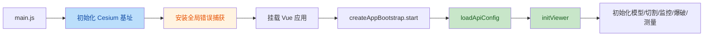

# 项目架构说明

本仓库采用前后端分离的单仓结构：

```text
cesium-simulation-platform/
├── cesium1/      # 前端：Vue 3 + Vite + CesiumJS
├── backend-py/   # 后端：FastAPI + PyMySQL
└── docs/         # 架构、部署、协作等文档
```

## 模块分层

- `src/app/`：应用启动编排，如 `createAppBootstrap.js`。
- `src/composables/`：跨业务复用的组合式能力，如 `useViewer.js`。
- `src/features/`：按业务域拆分的功能模块。
- `src/features/shared/index.js`：面向 `App.vue`、`components/`、`composables/` 的公共导出入口。
- `src/services/api/`：统一 API 初始化与配置加载。
- `src/stores/`：Pinia 状态仓库。
- `src/utils/`：日志、错误捕获、下载等通用工具。

## 前端启动流



## 当前边界约定

- `App.vue`、`src/components/`、`src/composables/` 优先通过 `src/features/shared/index.js` 使用功能模块。
- Feature 内部可以访问本 feature 的 `services/`、`types/`、`components/`，但不应暴露内部 manager/core 细节给外层。
- 全局错误捕获统一通过 `src/utils/globalErrorCapture.js` 安装，不再直接赋值 `window.onerror`。
- Cesium 静态资源基址统一通过 `src/utils/cesiumBaseUrl.js` 初始化，兼容现有 `/Cesium.js` 直出方式。

## 后续建议

- 优先继续压缩 `useStress.js`、`useModel.js`、`useMonitoring.js` 这类 orchestrator 文件的职责。
- 在 `logger.js` 之上继续接入 Sentry 或其他远端日志平台。
- 将 `docs/` 作为工程交付的一部分持续维护，而不是只保留一次性的优化方案。
